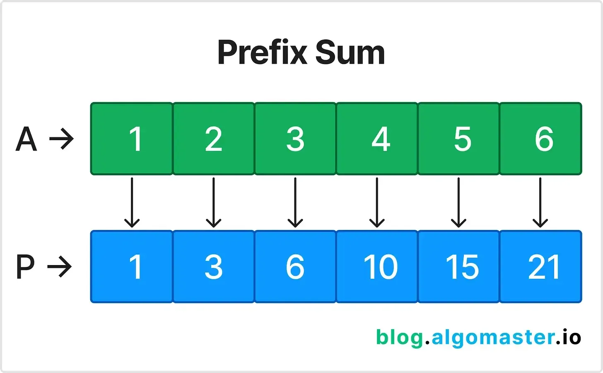
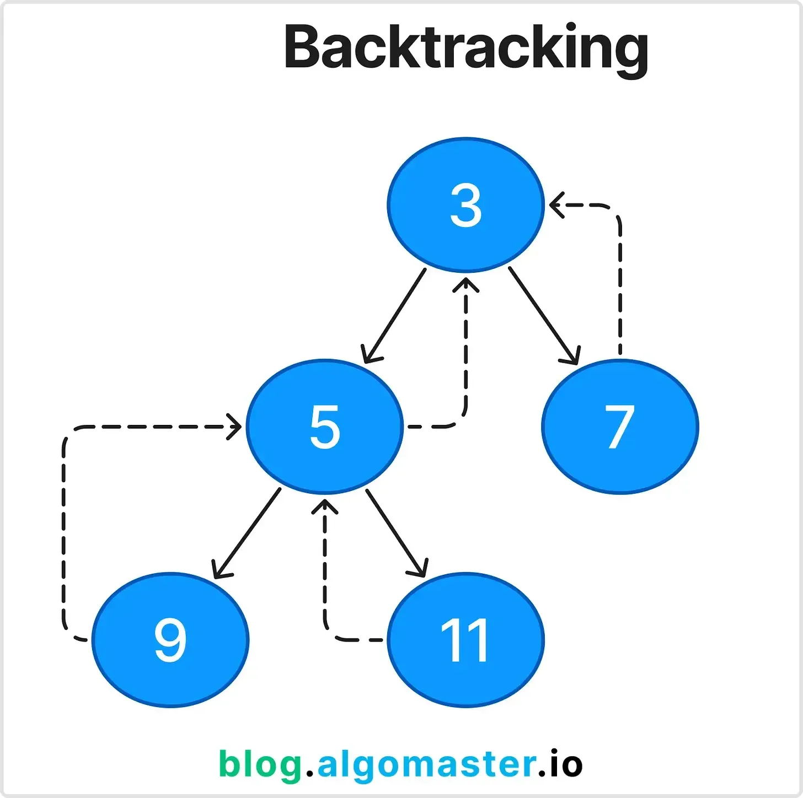

# Profile
[leetcode](https://leetcode.com/u/gabrielcambe/)

# Patterns
## Prefix Sum

It consists of preprocessing an array to create a new one where each element is the sum of all elements before it.
- It can be used to get the sum of a seb array in constant time
- It can be used to get efficient cummulative sum queries
- Examples:
  - [303](./303.%20Range%20Sum%20Query%20-%20Immutable/README.md)

## Backtracking

It is essentially a search. You can use backtracking to solve problems where you have to generate all possible solutions to something. You have a validation for the solution, and you use recursion to generate a solution, test if it is valid, save it, and backtrack to generae a new solution.
- Examples:
  - [46](./46.%20Permutations/README.md)
  - [78](./78.%20Subsets/README.md)

## Sliding Window
It consists of using a window to traverse the array and keep track of the sum of the elements in the window.

## Two Pointers
It consists of using two pointers to traverse the array and keep track of the sum of the elements in the window.

## Binary Search
It consists of using a binary search to find the index of the element in the array.
